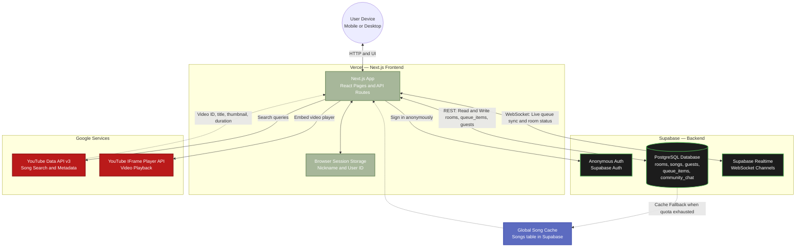
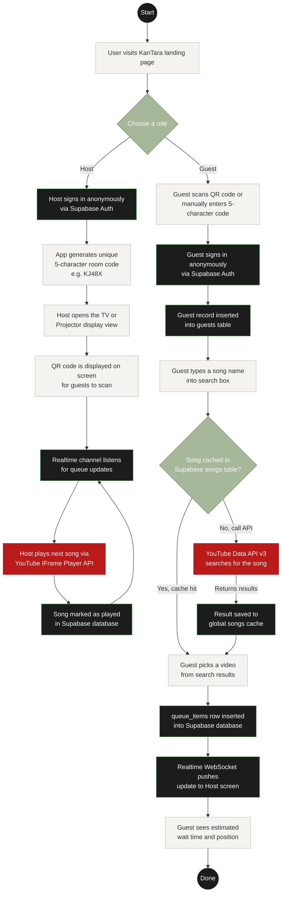

# KanTara Architecture & User Flow Diagrams

> [!TIP]
> Copy each code block below into **[Mermaid Live Editor](https://mermaid.live/)** and click **"Save as PNG"** to export the image for your YouTube API audit form.

---

## 1. Architecture Diagram

---

## 2. User Flow Diagram

